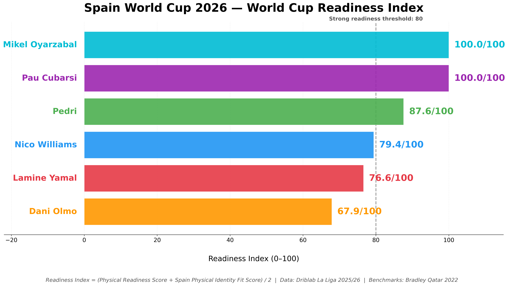
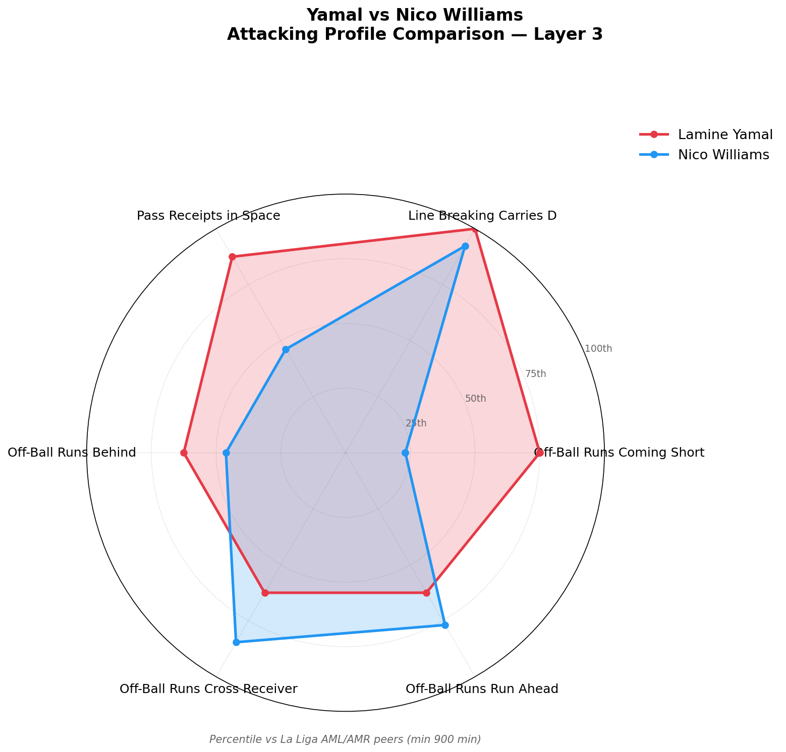

# Spain World Cup 2026 - Physical Readiness & Game Intelligence Analysis | Data: Driblab La Liga 2025/26 | Framework: Bradley Qatar 2022

**Are Spain's key La Liga players physically and tactically ready for the 2026 World Cup?**

This project combines season-long La Liga 2025/26 club data from Driblab with physical benchmarks derived from Paul Bradley's peer-reviewed research on the FIFA World Cup Qatar 2022 to assess the physical readiness and game intelligence profiles of six Spain internationals.

---

## Key Findings

- Pau Cubarsí and Mikel Oyarzabal recorded the highest Readiness Index scores (100.0)
- Pedri emerged as Spain's primary progression engine — ranking in the 100th percentile for line breaking passes, through balls and bypassed defenders among La Liga positional peers
- Dani Olmo recorded the lowest Readiness Index but produced the most complete Layer 3 game intelligence profile across both progression and final-third access metrics
- Lamine Yamal and Nico Williams contribute to progression and final-third access through different mechanisms — Yamal through receiving and carrying, Nico through direct runs and space attacks
- Spain's attacking structure appears to function as an interconnected progression network rather than a linear sequence

---

## Published Article

[Beyond Physical Readiness: Who Is Driving Spain's Attack Ahead of the 2026 World Cup?](#)

---

## Players Analysed

| Player | Position | Club |
|--------|----------|------|
| Pau Cubarsí | Centre Back | FC Barcelona |
| Pedri | Central Midfielder | FC Barcelona |
| Dani Olmo | Attacking Midfielder | FC Barcelona |
| Lamine Yamal | Wide Forward | FC Barcelona |
| Nico Williams | Wide Forward | Athletic Club |
| Mikel Oyarzabal | Centre Forward | Real Sociedad |

---

## Project Structure

The analysis is built across three layers.

### Layer 1 — Physical Readiness Score

Measures whether each player's La Liga physical output meets the positional standards observed across the 2022 World Cup.

**Benchmark:** Bradley's Qatar 2022 positional medians from Part 1 — 722 player observations across 64 games.

**Metrics (per 90 minutes):**
- Total Distance
- High Intensity Distance Z4+Z5 (≥19.8 km/h)
- Sprint Distance Z5 (≥25.2 km/h)
- Average Max Speed

**Method:** Each metric expressed as a percentage of the Qatar 2022 positional benchmark. Four percentages averaged and capped at 100.

---

### Layer 2 — Spain Physical Identity Fit Score

Measures how closely each player's physical profile aligns with Spain's specific physical identity at Qatar 2022.

**Benchmark:** Bradley's Part 2 findings on Spain's team physical identity. Spain's physical ratios from Part 2 are applied to Part 1 positional benchmarks to produce Spain-adjusted positional benchmarks.

**Spain ratios applied:**
- Total Distance: 107,700 / 108,100 = 0.996
- Z4+Z5: 8,716 / 9,001 = 0.968
- Sprint Distance: 2,149 / 2,345 = 0.916

**Metrics (per 90 minutes):**
- Total Distance
- High Intensity Distance Z4+Z5
- Sprint Distance Z5

---

### Readiness Index

```
Readiness Index = (Physical Readiness Score + Spain Physical Identity Fit Score) / 2
```

| Player | Physical | Identity | Readiness Index |
|--------|----------|----------|-----------------|
| Pau Cubarsí | 100.0 | 100.0 | **100.0** |
| Mikel Oyarzabal | 100.0 | 100.0 | **100.0** |
| Pedri | 87.7 | 87.6 | **87.6** |
| Nico Williams | 80.9 | 77.9 | **79.4** |
| Lamine Yamal | 78.5 | 74.7 | **76.6** |
| Dani Olmo | 70.4 | 65.4 | **67.9** |



---

### Layer 3 — Game Intelligence Profiles

Investigates how each player contributes to the progression and final-third actions most strongly associated with Spain's physical identity — motivated by Bradley's Part 2 correlations:

- Progression events — r=0.73
- Final third entries — r=0.75

**Data:** Driblab Arrigo metrics — all 611 La Liga players, one API call, season totals.

**Method:** Per 90 conversion of counting metrics. Percentile rankings against La Liga positional peers with minimum 900 minutes threshold.

**Positional peer groups:**
- Cubarsí → DC (73 peers)
- Pedri → DMC (22 peers)
- Olmo → AMC (15 peers)
- Yamal → AMR (8 peers)
- Nico → AML (13 peers)
- Oyarzabal → FW (51 peers)

**Layer 3 is not scored.** Arrigo metrics are interpreted as season-level intelligence profiles and are therefore presented descriptively rather than aggregated into a single score. Percentile rankings against La Liga positional peers provide the comparative context.

**Key Finding:** Dani Olmo — the player with the lowest Readiness Index — produces the most complete game intelligence profile across both progression and final-third access metrics. Physical readiness and game intelligence are not always the same thing.





---

## Data Sources

| Source | Description |
|--------|-------------|
| Driblab Physical Data | La Liga 2025/26 game-by-game physical output per player |
| Driblab Arrigo | La Liga 2025/26 game intelligence metrics — 611 players |
| Bradley Part 1 | Qatar 2022 positional physical benchmarks |
| Bradley Part 2 | Qatar 2022 team physical identity and tactical correlations |

**Note:** Driblab API access was provided through a collaboration with Driblab. API credentials are not included in this repository. Replace `API_TOKEN = ""` in the setup cells with your own token to reproduce the data pull.

---

## Methodology Notes

**Game filtering threshold:** 70% of each player's personal median total distance. Games below this threshold are excluded as unrepresentative of full physical output — injury returns, substitution appearances and tactical rest games.

**Speed thresholds:** Driblab uses 19.8 km/h and 25.2 km/h. Bradley uses 20.0 km/h and 25.0 km/h. The difference is negligible and acknowledged in the limitations.

**Pedri positional note:** Driblab classifies Pedri as DMC. His Layer 3 percentiles reflect that peer group — defensive and central midfielders — rather than a pure attacking midfielder comparison. His game intelligence profile far exceeds the typical DMC profile.

**Spain Part 2 ratios:** Team totals applied to positional benchmarks from Part 1. This assumes Spain's physical identity was consistent across positions — a simplification acknowledged given Part 2 presents team not player level data.

---

## Limitations

- Analysis is based on La Liga club data rather than Spain national team data — player output reflects club context and tactical systems which may differ from international tournament conditions
- Arrigo metrics are presented as season-level intelligence profiles rather than aggregated into a scored index — phase of play context and opponent defensive structure represent natural extensions for future iterations of this framework
- Spain's Part 2 physical ratios are team totals applied to positional benchmarks from Part 1 — this assumes consistent physical identity across positions, a simplification acknowledged given Part 2 presents team not player level data
- Speed threshold differences between Driblab (19.8/25.2 km/h) and Bradley (20.0/25.0 km/h) are negligible but acknowledged
- Between 1 and 3 games per player excluded from the physical dataset due to tracking coverage gaps
- At the time of publication Lamine Yamal and Nico Williams were carrying injuries with uncertain availability for Spain's opening games — their scores reflect season-long output when match fit, not current fitness status

---

## Repository Structure

```
├── Spain_2026.ipynb          # Main analysis notebook
├── README.md                 # Project documentation
└── visuals/                  # All project charts
    ├── world_cup_readiness_index_hero_ranking.png
    ├── physical_vs_intelligence_scatter.png
    ├── layer3_pedri.png
    ├── layer3_dani_olmo.png
    ├── layer3_yamal_vs_nico_radar.png
    └── spain_attacking_network.png
```

---

## How to Run

1. Clone the repository
2. Install dependencies:
```bash
pip install requests pandas numpy matplotlib scipy
```
3. Add your Driblab API token to each setup cell where `API_TOKEN = ""`
4. Run all cells in order — Runtime → Run All in Google Colab or Jupyter

**Note:** The API token expires periodically. If cells fail with authentication errors regenerate your token from the Driblab platform and update the setup cells.

---

## References

Bradley, P. S., Ade, J., Peart, D., Sheldon, W., & Olsen, P. (2024). *Setting the Benchmark Part 1: Physical Performance Profiles at the FIFA World Cup Qatar 2022*. Biology of Sport, 41(1), 261–270.

Bradley, P. S., Ade, J., Peart, D., Sheldon, W., & Olsen, P. (2024). *Setting the Benchmark Part 2: Physical Demands and Team Success at the FIFA World Cup Qatar 2022*. Biology of Sport, 41(1), 271–278.

Driblab Arrigo Platform. La Liga 2025/26 player data. Accessed June 2026.

---

## Author

**Yiannis Kastritis**
Football Data Analyst | MSc Football Data Analytics (UCAM Murcia / Sports Data Campus)

Portfolio: [yiannis4.github.io](https://yiannis4.github.io)
GitHub: [github.com/YIANNIS4](https://github.com/YIANNIS4)

*Data provided by Driblab. Framework inspired by Paul Bradley's Setting the Benchmark research series.*
